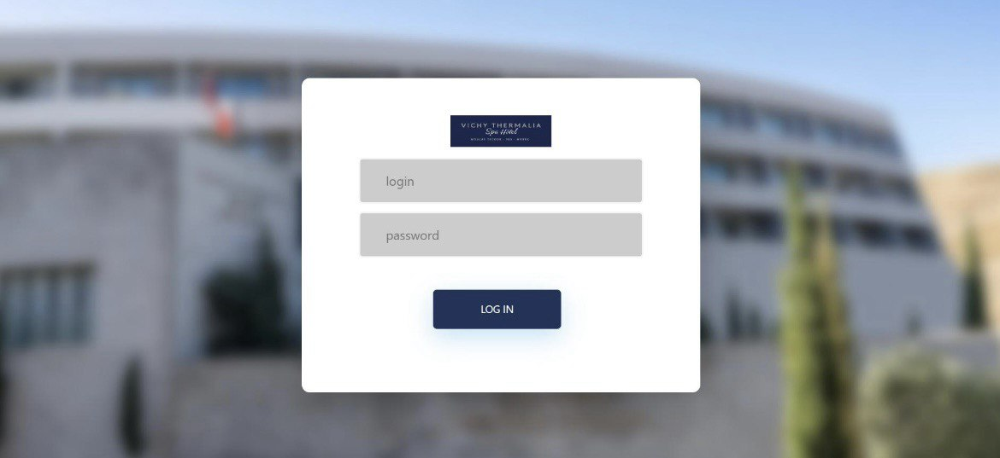
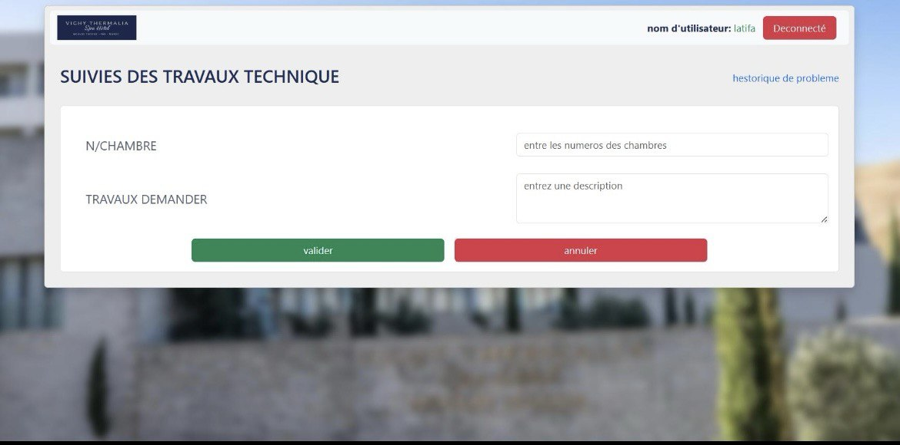
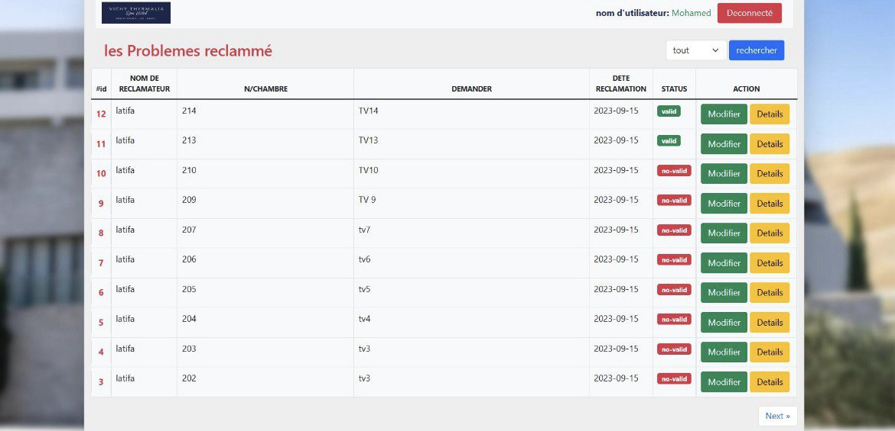
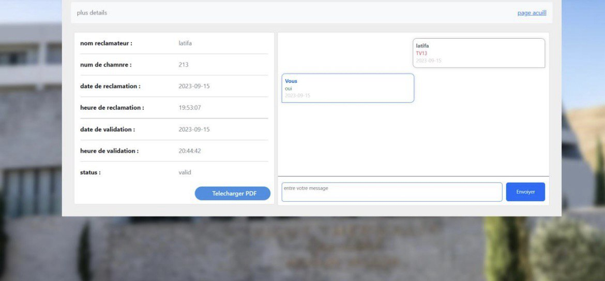

# Projet HotelPHP

## Description
This project is a PHP-based hotel management system. It includes various modules for managing users, handling reclamations, and generating reports. The project is organized into different directories for administrators, technicians, and other roles.

## Features
- User management (add, modify, delete users)
- Reclamation handling
- PDF generation for reports
- Role-based access (Administrator, Technician, etc.)
- Integration with PHPMailer for email functionality
- Use of FPDF library for PDF generation

## Project Structure
```
AdminPage.php
config.php
DirecteurPage.php
page_connexion.php
ReclamePage.php
Send.php
TechnicienPage.php
Administrateur/
    AjouterUser.php
    DetailsAdmin.php
    messages.php
    ModifierMessage.php
    ModifierUser.php
    page_gestAdmin.php
    page_utilisateur.php
    SupprimerGestion.php
    SupprimierUser.php
    TelchargerADMN.php
bootrap/
    bootstrap.min.css
    jquery-v3.js
databaseCode/
    data.sql
directeurGeneral/
    db2.txt
    DetailsDirecteur.php
    TelchargerDERCT.php
fpdfBiblio/
    changelog.htm
    FAQ.htm
    fpdf.css
    fpdf.php
    install.txt
    license.txt
images/
    Reclamation.php
phpmailer/
    COMMITMENT
    composer.json
    LICENSE
    README.md
Reclamateur/
    DetailsReclamateur.php
    hestoriqueReclamateur.php
    TelchargerRCLPDF.php
Technicien/
    DetailsTechnicien.php
    ModifierTechnicien.php
    TelchargerTECPDF.php
```

## Screenshots
Below are some screenshots of the application:

### Login Page


### Reclamation Page


### List of Reclames


### Details with Chat


## Libraries Used
- **FPDF**: For generating PDF files.
- **PHPMailer**: For sending emails.
- **Bootstrap**: For responsive design.

## Setup Instructions
1. Clone the repository.
2. Import the `data.sql` file from the `databaseCode/` directory into your MySQL database.
3. Configure the database connection in `config.php`.
4. Start a local server (e.g., XAMPP, WAMP) and place the project in the `htdocs` directory.
5. Access the application via `http://localhost/HotelCare-Management-System`.

## social media :
- facebook page : MG-code
- LinkedIn : mohammed elghandori
